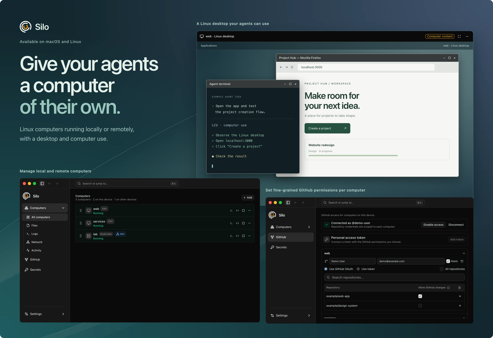

# Silo

Silo gives agents computers. Each computer is a Linux virtual machine powered by [MicroSandbox](https://github.com/superradcompany/microsandbox), with its own files, tools, and processes, sandboxed from your device. Work locally on macOS or Linux, or connect to another device over SSH.

Use your usual editor and terminal, give an AI agent a Linux desktop, and choose which repositories and credentials each computer can access.

[Download](https://github.com/amontlabs/silo/releases/latest) · [Website and demo](https://silo.amontlabs.com) · [Build from source](docs/SiloUI-BUILD-FROM-SOURCE.md) · [Documentation](docs/README.md)



## What you can do

- **Work across devices.** Create, start, stop, and monitor local and remote computers in one app. Each computer has its own page for its settings, checkpoints, storage, and SSH access.
- **Use familiar tools.** Open projects in your editor or terminal, browse files, and connect to development servers through local addresses.
- **Give agents a desktop.** New computers have the Linux desktop built in, with computer use for agents. Silo downloads ChatGPT for Linux from OpenAI automatically on each device, and computer use becomes ready by itself once that one-time download and the computer's setup finish. Choose **Set up computer use** on a computer's page after installing a new agent, and use its switch to let agents act without asking. Install and sign in to the agents inside the computer yourself. See the [computer-use plan](docs/SiloUI-COMPUTER-USE-PLAN.md).
- **Control GitHub access.** Connect through OAuth and select repositories for each computer, with read-only access by default. Alternatively, use a [personal token](docs/SiloUI-GITHUB-PERSONAL-TOKENS.md), which grants the token's full permissions.
- **Scope API credentials.** Store credentials in your device's credential store and choose the computers and HTTPS domains that can use them. See [how secrets work](docs/SiloUI-SECRETS.md).
- **Save and branch state.** Create checkpoints of a computer, restore it to an earlier checkpoint, or fork a new computer with a copy of its files.
- **Move computers and troubleshoot.** Export a local computer or checkpoint to an export file and import it as a new computer on this or another device. Search or export logs alongside activity history.

## Install

The computer runtime, base Linux image, and Git tools are bundled. Silo downloads ChatGPT for Linux in the background for computer use. Computers created before the built-in desktop download optional desktop packages when you add a desktop.

| Platform | Requirements | Download |
| --- | --- | --- |
| macOS | Apple Silicon, macOS 14+ | [DMG](https://github.com/amontlabs/silo/releases/latest/download/Silo-macos-arm64.dmg) |
| Linux x86-64 | Ubuntu 24.04-compatible system | [DEB](https://github.com/amontlabs/silo/releases/latest/download/Silo-linux-x64.deb) · [AppImage](https://github.com/amontlabs/silo/releases/latest/download/Silo-linux-x64.AppImage) |
| Linux ARM64 | Ubuntu 24.04-compatible system | [DEB](https://github.com/amontlabs/silo/releases/latest/download/Silo-linux-arm64.deb) · [AppImage](https://github.com/amontlabs/silo/releases/latest/download/Silo-linux-arm64.AppImage) |

**macOS:** open the DMG and drag Silo to Applications. The app is not notarized; first launch may require **System Settings → Privacy & Security → Open Anyway**.

**Linux:** in the download directory, run `sudo apt install ./Silo-linux-x64.deb` (use `Silo-linux-arm64.deb` for ARM64). Accept the update-source prompt to receive releases through Software Updater. For AppImage, enable **Allow executing file as program** in its file properties, then launch it. Local computers require KVM access; GitHub and secrets require a working Secret Service credential store, such as GNOME Keyring.

Upgrading an older installation? Saved data is converted automatically on first launch, but exports from earlier versions cannot be imported. Read the [release notes](https://github.com/amontlabs/silo/releases/latest) for required migration steps.

## Start working

1. **Create a computer.** Follow setup to choose its name, CPU, memory, and disk size. GitHub is optional. The Linux desktop and computer use are built in. Use **Add → New computer** to create more later.
2. **Open your project.** Start the computer and open its terminal. Create or clone your project in `/workspace`; use HTTPS URLs for Silo's GitHub integration. In **Files**, open a folder in your preferred editor.
3. **Open a development server.** Run it inside the computer, listening on `0.0.0.0`. In **Network**, connect a discovered port or choose **Add port**, then open the displayed address on your device.
4. **Open the desktop.** Choose **Open Linux desktop** from the computer's actions. Closing the viewer leaves its graphical apps running. A computer created before the built-in desktop keeps its current setup: add a desktop with **Add Linux desktop**, then choose **Set up LCU** in the viewer, which needs the official ChatGPT Linux app inside the computer. Create a new computer for automatic computer use.

Stopping a computer ends its running programs and preserves its files. Names and disk sizes are fixed after creation; changing CPU or memory stops the computer and applies on its next start. Quitting Silo stops local computers; computers on other devices keep running.

## Connect another device

Install the same version of Silo on both devices; a device with an older version must update before they connect. You can connect during setup without creating a local computer.

1. On the device that will run the computers, enable SSH access (**Remote Login** on macOS). In **Settings → Connections**, enable **Allow connections from other devices** and copy the address.
2. On your device, choose **Add → Connect device…**, paste the address, and follow the SSH setup prompts.
3. Use its computers alongside your local ones. Choose **Run on** when creating a computer to select its device.

Keep Silo running on the device that owns the computers. Manage its GitHub account, secrets, exports, and imports there. See [Connections](docs/SiloUI-CONNECTIONS.md) for details.

## Develop Silo

The app uses React/TypeScript and Rust/Tauri in [`app/SiloUI`](app/SiloUI). Follow the [source-build guide](docs/SiloUI-BUILD-FROM-SOURCE.md) to install prerequisites and configure your own GitHub App, then run from the repository root:

```sh
npm --prefix app/SiloUI ci
npm --prefix app/SiloUI run desktop
```

For checks and release procedures, see the [development and release guide](docs/SiloUI-RELEASES.md). For the browser demo, see the [website README](website/README.md).

## Help and license

Check **Logs** and **Activity** for errors. [Report an issue](https://github.com/amontlabs/silo/issues) with your app version, OS, and reproduction steps; remove private data from shared logs.

Silo is [MIT licensed](LICENSE). Bundled dependencies have their own [licenses and notices](app/SiloUI/THIRD-PARTY-NOTICES.md).
